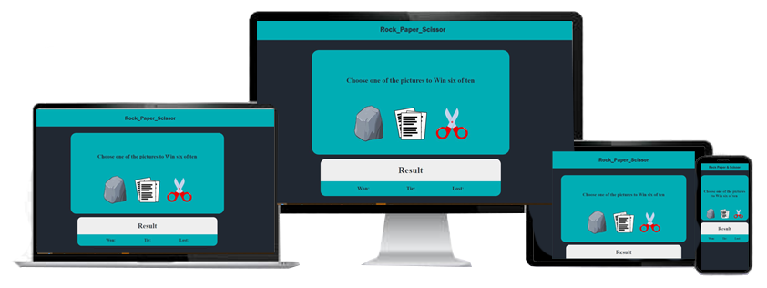
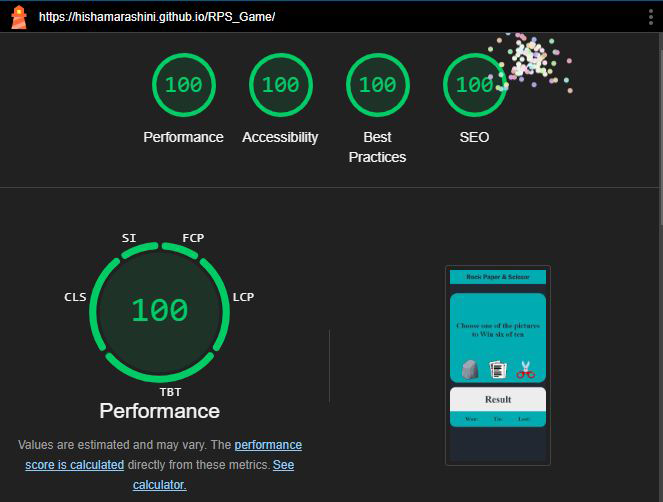

# **RPS Game**
[RPSGame link](https://hishamarashini.github.io/RPS_Game/)

RPS is a family game that is used for choosing or deciding for an idea between two or more, so i choose that the player will check the chance with the computer.
Its a simple game that player will try to win six of ten attempts either a winner or loser also if its tie.

### Features
- The Header
The header is the logo **ROCK_PAPER_SCISSOR** with clear contrast with the background color.
- Game view
In the center of the screen player will find text that explain for him to push one of the three images that are found in the middle also and they are images of the shapes of Rock , paper and Scissor

---
  
---

---
Under the images the player will find the result and counter for winning , tie, and lost

### Testing
>The page is tested in different browsers, Chrome, Firefox, and Edge.
>I confirmewd that the project is responsive, looks good and functionon all standard screens size with good color contrast.

### Validator Testing
**HTML**

**CSS**

**Javascript**

**Accessibility**

I confirmed that the colors and fonts chosen are easy to read and accessible by running them in lighthouse.

**Credits**
Content
- The code async explanation was taken from w3School 

Media
- The images from google clipart images.