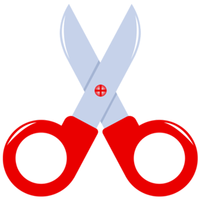

# **RPS Game**
[RPSGame link](https://hishamarashini.github.io/RPS_Game/)

RPS is a family game that is used for choosing or deciding for an idea between two or more, the player will check the chance with the computer.
Its a simple game that player will try to win six of ten attempts either a winner or loser also if its tie.

### Features
- The Header
The header is the logo **ROCK PAPER & SCISSOR** with clear contrast with the background color.
- Game view
In the center of the screen player will find text that explain for him to click one of the three images the rock, paper or scissor those that are found in the middle of the screen.
---
  
---

---
Under the images the player will find the result and counter for winning , tie, and lost

also after playing the player will get the result with one of the images under upon his result won or lose even tied.

  

### Testing
> The page is tested in different browsers, Chrome, Firefox, and Edge.
> I confirmewd that the project is responsive, looks good and functionon all standard screens size with good color contrast.
> I tested all the clicking on images

| Name | Discription |
| ---- | ----------- |
| Rock | 80 times|
| Paper |75 times|
|Scissor|70 times|

and all was working in good condition.

### Validator Testing
**HTML**

**CSS**

**Javascript**

**Accessibility**

I confirmed that the colors and fonts chosen are easy to read and accessible by running them in lighthouse.

Deployment

> I started the site in visual studio and link it to a new repository in github and give it RPS Game name 
and each update to the project i commit it , at the end i opened the github repository and navigate to 
settings tab and from the source section i selected the main branch and save it automatically after 
refreshing i get successful deployment
The live link can be found here - https://hishamarashini.github.io/RPS_Game/

**Credits**
Content
- The reference of code async explanation was from w3School 

Media
- The images from google clipart images.