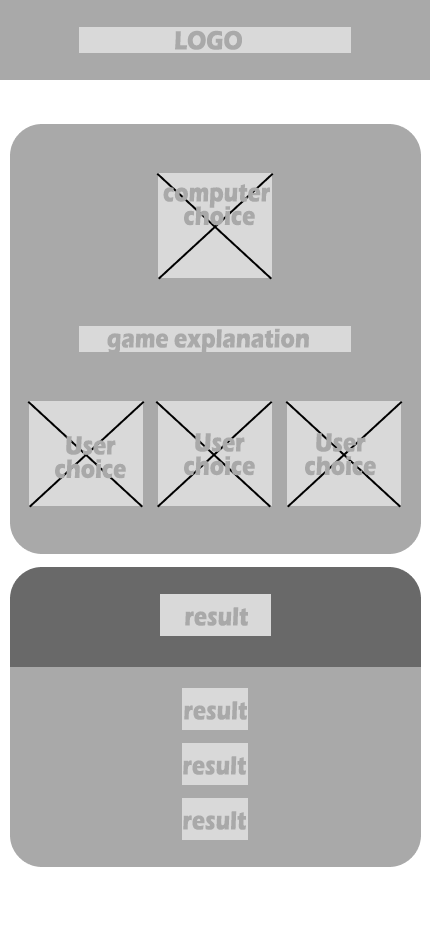

### Abstract
> I choosed to make **Rock, scissor, and paper** game because it is a simple game and player will have fun, and i choosed to give it a challenge image with provocative result to let the player attracted to it.

### Modules

> ##### rungame(user_choice) => null
I started with this function to make the game active and ready for player to or user have a choice then to give limit for user choices i added 
> let cpu_choice = Math.floor(Math.random() * 3);

which give the user just three choices which i have to add tie, won or lose

> if (user_choice === cpu_choice){
        document.getElementById("h1-result").innerHTML = "tie";
        scoreTie += 1;
>}else {
        document.getElementById("h1-result").innerHTML = "Won"; 
        scoreWon += 1;
    } 
}else if(user_choice === 0 && cpu_choice === 1){
        document.getElementById("h1-result").innerHTML = "Lose";
        scoreLose += 1;
    }else if(user_choice === 1 && cpu_choice === 2){
        document.getElementById("h1-result").innerHTML = "Lose";
        scoreLose += 1;
    }else if(user_choice === 2 && cpu_choice === 0){
        document.getElementById("h1-result").innerHTML = "Lose";
        scoreLose += 1;
    
Then to make it have a limit to end the game i used the limit six of ten and the game will restart

> if(scoreWon === 6 && scoreLose < 6 && scoreTie < 6){
        // you won
        document.getElementById("gameEnd_img").src = "assets/images/champion-clipart.png";
        document.getElementById("gameEnd_img").className = "";
        gameEnded = true;
        document.getElementById("score").style.display = "none";
    }else if(scoreLose === 6 && scoreWon < 6 && scoreTie < 6){
        // you lost
        document.getElementById("gameEnd_img").className = "";
        document.getElementById("gameEnd_img").src = "assets/images/youlose.png";
        gameEnded = true;
        document.getElementById("score").style.display = "none";
    }else if (scoreTie === 6 && scoreLose < 6 && scoreWon < 6){
        document.getElementById("gameEnd_img").className = "tie_style";
        document.getElementById("gameEnd_img").src ="assets/images/tie.png";
        gameEnded = true;
        document.getElementById("score").style.display = "none";
    }

and when it restart i used
> if(gameEnded){
        scoreWon = 0;
        scoreTie = 0;
        scoreLose = 0;
        document.getElementById("gameEnd_img").src = "";
        gameEnded = false;
        document.getElementById("score").style.display = "flex";
    }

After that to give the game more visual and atractive i make cpu use async fake choose between 0 and 10
> async function fake_choosing() {
	let loop_till_result = 10; // iterations until result shown.
	current = getRandomInt(0, 3);
	delta = 1;

	for(let i = 0; i < loop_till_result; i++)
	{
		if(current == 2) { delta = -1; } else if(current == 0) { delta = 1; }
		current += delta;

		switch_active_choice(current);

		await sleep(Math.max(100,i*10));

And for more nice visual i added images that explain for the user know that either he lost or won , or tied 

> if(scoreWon === 6 && scoreLose < 6 && scoreTie < 6){
        // you won
        document.getElementById("gameEnd_img").src = "assets/images/champion-clipart.png";
        document.getElementById("gameEnd_img").className = "";
        gameEnded = true;
        document.getElementById("score").style.display = "none";
    }else if(scoreLose === 6 && scoreWon < 6 && scoreTie < 6){
        // you lost
        document.getElementById("gameEnd_img").src = "assets/images/youlose.png";
        document.getElementById("gameEnd_img").className = "";
        gameEnded = true;
        document.getElementById("score").style.display = "none";
    }else if (scoreTie === 6 && scoreLose < 6 && scoreWon < 6){
        // Tied
        document.getElementById("gameEnd_img").className = "tie_style";
        document.getElementById("gameEnd_img").src = "assets/images/tie.png";
        gameEnded = true;
        document.getElementById("score").style.display = "none";

### Basic Design principle

